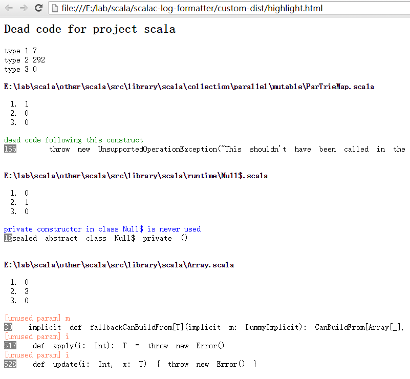

# scalac-log-formatter

Parse the warning log generated by `-Ywarn-dead-code -Ywarn-unused` and `scala-linter unused param` and high light them in code

## Usage
see `run.bat`

`scala <path-to>/scalac-log-formatter_2.11-1.1.jar -logSrc:logs/combine.log -logEncoding:GBK -srcEncoding:UTF-8 -dist:custom-dist -projectName:scala`

## Related projects

[scala-linter](https://github.com/at15/scala-linter)

## TODO

- [ ] tree view
- [ ] code highlight
- [ ] support custom rules